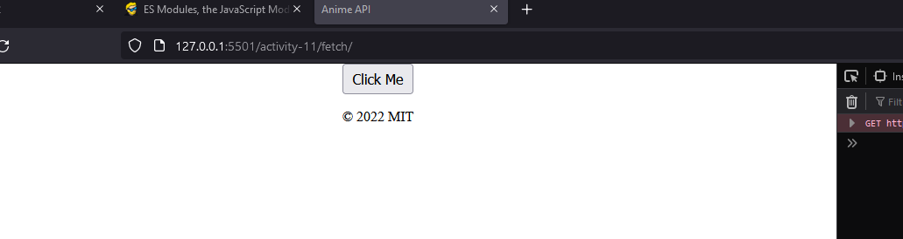
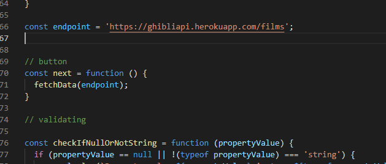
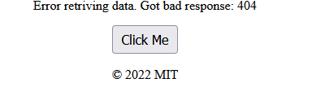
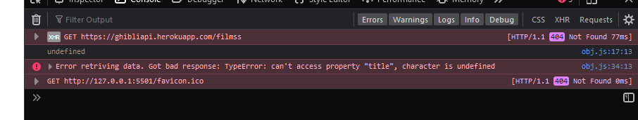
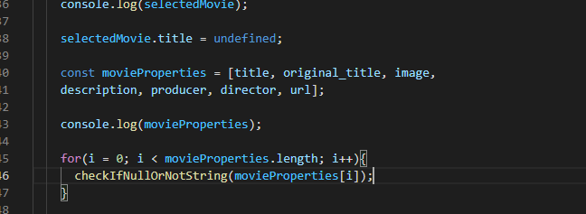
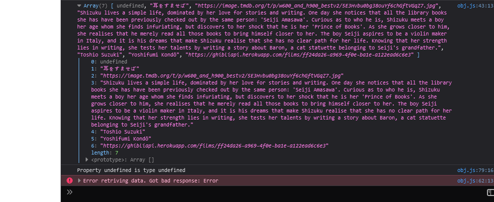
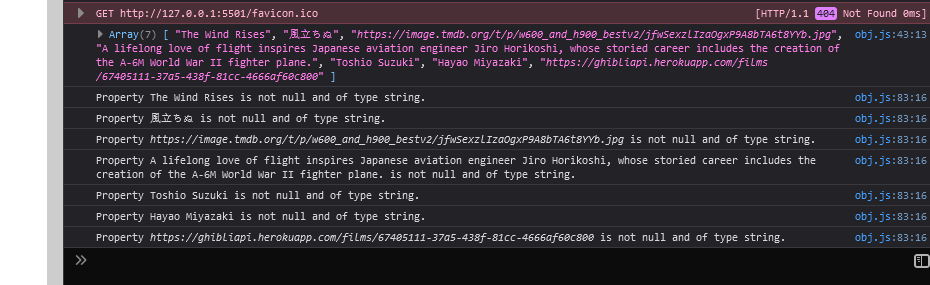

# cpnt262

## Maryam Khan

## Rest-api

## Code Journal

1. Using fetch() to retrieve data / HTML Output

  - I have created a repo `cpnt-rest-api`
     - Added files and folders
  - Tried bunch of api's at first but they did not cover the requirement of assignment and then i found `studio ghibli` it had almost every thing 
  - Using starter code we did in class i finished fetching data from api
  - HTML: h1,p and links

2. Interactivity
  
  - Created button in html 
  - Created a function and called the `fatchData` 
  - I was having problem. When i refresh page on html page i only had
  button it took me while then i realize this that i can call th function 
  once as ` fetchData(endpoint)` and then
  i can call it in button function

   

   

  - So i get the page once but it dosent refresh again
  - I just realize my button is not working Ahhhh !!!!
  - After so much of try i think i fixed it yey

3. Error handling

- fetch() Promises are handled by a catch block
-  For 200 OK response 

    

    

- First i created a function and wrote this piece of code to check if property is :

  if (propertyValue == null || !(typeof propertyValue) === 'string') {
    console.log(`Property ${propertyValue} is type ${typeof propertyValue}`);
    throw new Error();
  }
  else {
    console.log(`Property ${propertyValue} is not null and of type string.`);
  }

- In next step i am going to create an array and put loop to validate all of my properties

     

- This method dont work becouse i am not accesing the properties and I am accessing values.
-  I am getting the result but it is not right

    

    

- I am not going through whole array and i am just using few properties so it just not make sense.
- So i am going to check all of the values using 

    checkIfNullOrNotString(selectedMovie.original_title);

## Attributions

- [Studio Ghibli Api](https://ghibliapi.herokuapp.com/#section/Use-Case)
- Tony Grimes(starter code for fetching API)
- My own code for button
- MDN(Try Catch)
- Slides(Validating)

- [GH repo](https://github.com/maryambkhan/cpnt-rest-api)
- [GH Pages](https://maryambkhan.github.io/cpnt-rest-api/)
